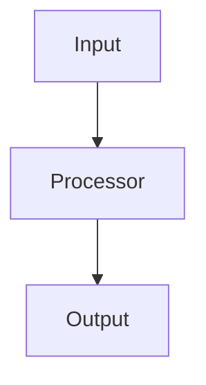

# OpenSpec Authoring

> **Single Source of Truth**: An OpenSpec set is the authoritative contract between human intent and agent execution. The Coder Agent reads Specs — not raw descriptions.

---

## 1. Directory Convention

Every OpenSpec set lives under `docs/openspecs/<task-name>/` and contains exactly **4 files**:

```
docs/openspecs/<task-name>/
├── proposal.md    # WHY & WHAT — context, scope, impact
├── specs.md       # HOW to verify — Gherkin-style scenarios
├── design.md      # HOW to build — architecture, data models, APIs
└── tasks.md       # WHAT to do — prioritized work items with checklists
```

---

## 2. Core Documents

### 2.1 `proposal.md` — Solution Proposal

| Section | Content |
|---------|---------|
| **Why** | Root cause or motivation (cite real logs/traces when available) |
| **What Changes** | Detailed change list, grouped by Issue |
| **Capabilities** | `New` / `Modified` / `Removed` capabilities |
| **Impact** | Table: `Area \| Files Affected` |

<details>
<summary>Template</summary>

```markdown
# Proposal: <Task Name>

## Why
<!-- Root cause, log traces, user pain points -->

## What Changes

### Issue 1: <Title>
- Change A
- Change B

### Issue 2: <Title>
- Change C

## Capabilities

### New Capabilities
- ...

### Modified Capabilities
- ...

### Removed Capabilities
- ...

## Impact

| Area | Files Affected |
|------|----------------|
| Router | `internal/router/router.go` |
| Service | `internal/feature/service.go` |
```

</details>

### 2.2 `specs.md` — Requirement Specifications

| Section | Content |
|---------|---------|
| **Requirements** | Grouped as `Added` / `Modified` / `Removed` |
| **Scenarios** | Gherkin-style `WHEN … THEN … AND …` |
| **Status Icons** | `✅` Done · `⚠️` In Progress · `❌` Not Started |

<details>
<summary>Template</summary>

```markdown
# Specs: <Task Name>

## Added Requirements

### REQ-001: <Title>
> ✅ Status: Implemented

**Scenario:**
- WHEN <precondition or action>
- THEN <expected outcome>
- AND <additional assertion>

### REQ-002: <Title>
> ❌ Status: Not Started

**Scenario:**
- WHEN ...
- THEN ...

## Modified Requirements

### REQ-M01: <Title>
> ⚠️ Status: In Progress

**Scenario:**
- WHEN ...
- THEN ...

## Removed Requirements
- REQ-R01: <removed capability description>
```

</details>

### 2.3 `design.md` — Technical Design

| Section | Content |
|---------|---------|
| **Architecture Diagram** | Mermaid flowchart / sequence diagram |
| **Data Models & API** | JSON/YAML Schema, Go structs, API endpoints |
| **Security & Execution Boundaries** | Agent sandbox permissions (read/write scope) |
| **Risk Mitigation** | Risk table with severity and mitigation plan |

<details>
<summary>Template</summary>

````markdown
# Design: <Task Name>

## Architecture



## Data Models

```go
type FeatureConfig struct {
    ID     string `json:"id"`
    Enabled bool  `json:"enabled"`
}
```

## API Endpoints

| Method | Path | Description |
|--------|------|-------------|
| POST | `/api/v1/feature` | Create feature |
| GET  | `/api/v1/feature/:id` | Get feature |

## Security & Execution Boundaries

| Agent | Allowed Paths | Permissions |
|-------|---------------|-------------|
| Coder | `internal/feature/` | Read, Write |
| Reviewer | `internal/` | Read only |

## Risk Mitigation

| Risk | Severity | Mitigation |
|------|----------|------------|
| Memory leak in loop | HIGH | Add context timeout |
| Schema drift | MEDIUM | JSON Schema validation |
````

</details>

### 2.4 `tasks.md` — Execution Task List

| Section | Content |
|---------|---------|
| **Task ID** | Numbered logically (e.g. `Task 1.1`, `Task 1.2`), linked to `specs.md` scenarios |
| **Priority** | `P0` (Critical) · `P1` (High) · `P2` (Medium) · `P3` (Low) |
| **Acceptance Criteria** | Specific, testable conditions for each task |
| **Checklist** | `[ ]` / `[x]` checkboxes for progress tracking |

<details>
<summary>Template</summary>

```markdown
# Tasks: <Task Name>

## P0 — Critical

### Task 1.1: <Title>
> Links to: REQ-001

**Acceptance Criteria:**
- [ ] Criterion A
- [ ] Criterion B

### Task 1.2: <Title>
> Links to: REQ-002

**Acceptance Criteria:**
- [ ] Criterion A

## P1 — High

### Task 2.1: <Title>
> Links to: REQ-M01

**Acceptance Criteria:**
- [ ] Criterion A
- [ ] Criterion B

## P2 — Medium
(none)

## P3 — Low
(none)
```

</details>

---

## 3. Golden Rules

| # | Rule | Rationale |
|---|------|-----------|
| 1 | **Single Source of Truth** | Agent Coder reads the Spec, not raw user descriptions. The OpenSpec must reflect actual execution structure. |
| 2 | **Parallel Decomposition** | Subtasks designed for parallel execution must be resource-independent, or define explicit file-change context flow. |
| 3 | **Validation & Security First** | Always define JSON Schema for agent output validation. Always constrain `execution_boundaries` to prevent memory leaks and security breaches. |

---

## 4. Authoring Decision Matrix

| Situation | Start With |
|-----------|------------|
| Bug fix with known root cause | `proposal.md` → `specs.md` → `tasks.md` (skip `design.md` if architecture unchanged) |
| New feature from scratch | `proposal.md` → `design.md` → `specs.md` → `tasks.md` |
| Refactoring / migration | `proposal.md` → `design.md` → `tasks.md` → `specs.md` |
| Hotfix / emergency patch | `tasks.md` only (backfill others after resolution) |

---

## 5. Anti-Patterns

| ❌ Don't | ✅ Do |
|----------|-------|
| Write vague requirements without scenarios | Use Gherkin-style `WHEN/THEN/AND` for every requirement |
| Mix multiple unrelated issues in one spec set | Create separate `docs/openspecs/<name>/` per logical scope |
| Skip the Impact table in `proposal.md` | Always list affected files — agents depend on this for context loading |
| Assign tasks without acceptance criteria | Every task must have at least one testable criterion |
| Leave status icons stale | Update `✅ ⚠️ ❌` as work progresses |

---

## 6. Checklist Before Submission

- [ ] All 4 files exist in `docs/openspecs/<task-name>/`
- [ ] `proposal.md` has Why, What Changes, Capabilities, Impact sections
- [ ] `specs.md` has at least one `WHEN/THEN` scenario per requirement
- [ ] `design.md` includes a Mermaid diagram (if architecture changes)
- [ ] `tasks.md` tasks link back to `specs.md` requirement IDs
- [ ] All status icons (`✅ ⚠️ ❌`) are current
- [ ] No task lacks acceptance criteria
