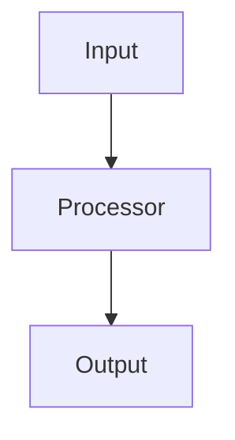

### 2.3 `design.md` — Technical Design

| Section | Content |
|---------|---------|
| **Architecture Diagram** | Mermaid flowchart / sequence diagram |
| **Data Models & API** | JSON/YAML Schema, Go structs, API endpoints |
| **Security & Execution Boundaries** | Agent sandbox permissions (read/write scope) |
| **Risk Mitigation** | Risk table with severity and mitigation plan |

<details>
<summary>Template</summary>

````markdown
# Design: <Task Name>

## Architecture



## Data Models

```go
type FeatureConfig struct {
    ID     string `json:"id"`
    Enabled bool  `json:"enabled"`
}
```

## API Endpoints

| Method | Path | Description |
|--------|------|-------------|
| POST | `/api/v1/feature` | Create feature |
| GET  | `/api/v1/feature/:id` | Get feature |

## Security & Execution Boundaries

| Agent | Allowed Paths | Permissions |
|-------|---------------|-------------|
| Coder | `internal/feature/` | Read, Write |
| Reviewer | `internal/` | Read only |

## Risk Mitigation

| Risk | Severity | Mitigation |
|------|----------|------------|
| Memory leak in loop | HIGH | Add context timeout |
| Schema drift | MEDIUM | JSON Schema validation |
````

</details>

### 2.4 `tasks.md` — Execution Task List (Plan-Writing Hybrid)

> 📌 **This format merges OpenSpec tracking with plan-writing execution detail.**
> A well-written `tasks.md` eliminates the need for a separate `docs/plans/PLAN-*.md`.
> Each step must be a single action (2-5 minutes) with exact file paths, real code, and runnable commands.

| Section | Content |
|---------|---------|
| **Header** | Goal, Architecture summary, Tech Stack (from `design.md`) |
| **Task ID** | Numbered logically (e.g. `Task 1.1`, `Task 1.2`), linked to `specs.md` scenarios |
| **Priority** | `P0` (Critical) · `P1` (High) · `P2` (Medium) · `P3` (Low) |
| **Files** | Exact paths: `Create`, `Modify` (with line ranges), `Test` |
| **Steps** | Bite-sized (2-5 min each): write test → verify fail → implement → verify pass → commit |
| **Code Blocks** | Every code step MUST include the actual code — no placeholders |
| **Commands** | Exact shell commands with expected output |

#### No Placeholders

These are **task failures** — never write them:
- "TBD", "TODO", "implement later", "fill in details"
- "Add appropriate error handling" / "add validation"
- "Write tests for the above" (without actual test code)
- "Similar to Task N" (repeat the code — the agent may read tasks out of order)
- Steps that describe what to do without showing how

<details>
<summary>Template</summary>

````markdown
# Tasks: <Task Name>

> **For agentic workers:** Use subagent-driven-development or executing-plans
> to implement this plan task-by-task. Steps use checkbox syntax for tracking.

**Goal:** [One sentence describing what this builds]

**Architecture:** [2-3 sentences about approach, reference `design.md` for full detail]

**Tech Stack:** [Key technologies/libraries]

---

## P0 — Critical

### Task 1.1: <Title>
> Links to: REQ-001

**Files:**
- Create: `exact/path/to/file.go`
- Modify: `exact/path/to/existing.go:123-145`
- Test: `tests/exact/path/to/file_test.go`

- [ ] **Step 1: Write the failing test**

```go
func TestSpecificBehavior(t *testing.T) {
    result := Function(input)
    assert.Equal(t, expected, result)
}
```

- [ ] **Step 2: Run test to verify it fails**

Run: `go test ./tests/path/... -run TestSpecificBehavior -v`
Expected: FAIL with "undefined: Function"

- [ ] **Step 3: Write minimal implementation**

```go
func Function(input string) string {
    return expected
}
```

- [ ] **Step 4: Run test to verify it passes**

Run: `go test ./tests/path/... -run TestSpecificBehavior -v`
Expected: PASS

- [ ] **Step 5: Commit**

```bash
git add tests/path/file_test.go src/path/file.go
git commit -m "feat: add specific feature (REQ-001)"
```

### Task 1.2: <Title>
> Links to: REQ-002

**Files:**
- Create: `exact/path/to/another_file.go`
- Test: `tests/exact/path/to/another_file_test.go`

- [ ] **Step 1: Write the failing test**

```go
// actual test code here — no placeholders
```

- [ ] **Step 2: Run test to verify it fails**

Run: `<exact command>`
Expected: FAIL with "<exact error>"

- [ ] **Step 3: Write minimal implementation**

```go
// actual implementation code here
```

- [ ] **Step 4: Run test to verify it passes**

Run: `<exact command>`
Expected: PASS

- [ ] **Step 5: Commit**

```bash
git add <exact files>
git commit -m "feat: <descriptive message> (REQ-002)"
```

## P1 — High

### Task 2.1: <Title>
> Links to: REQ-M01

**Files:**
- Modify: `exact/path/to/file.go:50-75`
- Test: `tests/exact/path/to/file_test.go`

- [ ] **Step 1: Write the failing test**
- [ ] **Step 2: Run test to verify it fails**
- [ ] **Step 3: Write minimal implementation**
- [ ] **Step 4: Run test to verify it passes**
- [ ] **Step 5: Commit**

## P2 — Medium
(none)

## P3 — Low
(none)

---

## Self-Review Checklist

After writing all tasks, verify:
1. **Spec coverage:** Every REQ in `specs.md` maps to at least one task.
2. **Placeholder scan:** No "TBD", "TODO", or vague descriptions remain.
3. **Type consistency:** Types, method signatures, and names match across tasks.
4. **File paths:** Every path is exact and exists (or will be created).
````

</details>

---

## 3. Golden Rules

| # | Rule | Rationale |
|---|------|-----------|
| 1 | **Single Source of Truth** | Agent Coder reads the Spec, not raw user descriptions. The OpenSpec must reflect actual execution structure. |
| 2 | **Parallel Decomposition** | Subtasks designed for parallel execution must be resource-independent, or define explicit file-change context flow. |
| 3 | **Validation & Security First** | Always define JSON Schema for agent output validation. Always constrain `execution_boundaries` to prevent memory leaks and security breaches. |

---

## 4. Authoring Decision Matrix

| Situation | Start With |
|-----------|------------|
| Bug fix with known root cause | `proposal.md` → `specs.md` → `tasks.md` (skip `design.md` if architecture unchanged) |
| New feature from scratch | `proposal.md` → `design.md` → `specs.md` → `tasks.md` |
| Refactoring / migration | `proposal.md` → `design.md` → `tasks.md` → `specs.md` |
| Hotfix / emergency patch | `tasks.md` only (backfill others after resolution) |

---

## 5. Anti-Patterns

| ❌ Don't | ✅ Do |
|----------|-------|
| Write vague requirements without scenarios | Use Gherkin-style `WHEN/THEN/AND` for every requirement |
| Mix multiple unrelated issues in one spec set | Create separate `docs/openspecs/<name>/` per logical scope |
| Skip the Impact table in `proposal.md` | Always list affected files — agents depend on this for context loading |
| Assign tasks without acceptance criteria | Every task must have at least one testable criterion |
| Leave status icons stale | Update `✅ ⚠️ ❌` as work progresses |

---

## 6. Checklist Before Submission

- [ ] All 4 files exist in `docs/openspecs/<task-name>/`
- [ ] `proposal.md` has Why, What Changes, Capabilities, Impact sections
- [ ] `specs.md` has at least one `WHEN/THEN` scenario per requirement
- [ ] `design.md` includes a Mermaid diagram (if architecture changes)
- [ ] `tasks.md` tasks link back to `specs.md` requirement IDs
- [ ] All status icons (`✅ ⚠️ ❌`) are current
- [ ] No task lacks acceptance criteria
