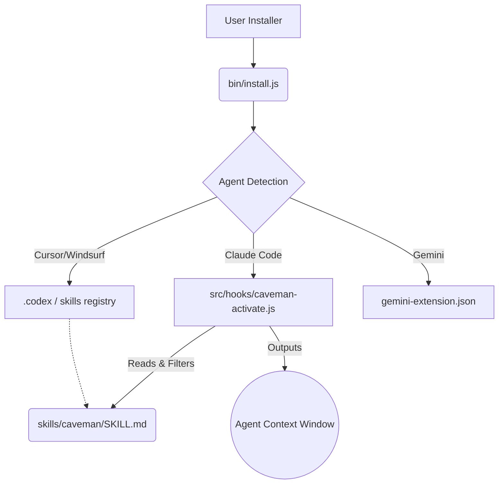

# Project Discovery Report — Caveman

## High Level
Caveman is a lightweight, agent-agnostic tool/skill that forces AI coding assistants (Claude Code, Cursor, Copilot, etc.) to speak tersely ("like a caveman"). Built primarily with Node.js and Bash, it saves an average of 65% on output tokens by compressing stylistic filler while maintaining 100% technical accuracy.

## Architecture
Caveman utilizes a **Decentralized Injection Architecture**. Instead of acting as a proxy server or middleman API, it installs natively into the local extension/plugin systems of 30+ different AI tools.
- **The Core**: A collection of highly optimized Markdown prompt files (`skills/caveman/SKILL.md`).
- **The Delivery**: `bin/install.js` discovers installed agents and links the prompts into their respective context registries.
- **The Glue (Dynamic Hook Injection)**: For CLIs like Claude Code, `src/hooks/caveman-activate.js` intercepts the `SessionStart` lifecycle event. It dynamically reads the Markdown ruleset, filters it, and injects it into the system prompt invisibly before the user even types a command.

*Why it was chosen:* This architecture is zero-latency (no proxy), privacy-preserving (no data leaves the machine), and requires zero configuration from the user post-installation.

## Design Patterns & Code Quality
- **Prompt as Infrastructure (Docs as Code):** The core intelligence of the application isn't in JS, but in the Markdown prompt. The JS merely acts as a delivery mechanism.
- **Cascading Fallbacks:** The activation hook (`caveman-activate.js`) attempts to read the prompt from multiple potential install locations. If all fail, it falls back to a hardcoded string, ensuring the agent *never* crashes on startup.
- **Code Quality:** The JavaScript is written in a pragmatic, zero-dependency style (using raw `fs` and `path`). It prioritizes startup speed (critical for a CLI hook) over framework abstraction.

## Interesting Techniques & Engineering Practices

1. **Tokenizer-Aware Prompt Engineering**
   In `skills/caveman/SKILL.md`, the AI is explicitly banned from using arrows (`→`) or inventing new abbreviations (`cfg`, `impl`). The prompt explains *why*: modern BPE tokenizers split invented words into multiple tokens, meaning "impl" might cost as many tokens as "implementation", but ruins human readability. This is a masterful understanding of LLM mechanics.

2. **Dynamic Markdown Context Filtering**
   Instead of feeding the entire `SKILL.md` (which contains 6 different intensity levels) to the LLM, `caveman-activate.js` parses the Markdown *at runtime*. It uses regex to extract only the table row and examples corresponding to the user's active intensity level. 
   *Why it's clever:* It maintains a single source of truth for humans (one clean Markdown file) but prevents confusing the LLM with contradictory instructions in its context window.

3. **The "Auto-Clarity" Escape Hatch**
   The prompt instructs the AI to automatically drop the "caveman" persona for security warnings, destructive actions (e.g., `DROP TABLE`), or complex multi-step sequences where omitted conjunctions could cause dangerous ambiguity. 

## Most Valuable Files (Hidden Gems)
1. `skills/caveman/SKILL.md` — **Why:** A masterclass in advanced prompt engineering. It demonstrates how to enforce strict behavioral constraints, handle multi-lingual inputs ("compress style, not language"), and optimize for BPE tokenizers.
2. `src/hooks/caveman-activate.js` — **Why:** Showcases how to build resilient CLI hooks that gracefully handle missing files, inject dynamic context, and interact with the host CLI's UI (via statusline flag files).

## Top 10 Things Worth Learning
| # | Concept | File | Why Useful | Difficulty | Order |
|---|---------|------|-----------|------------|-------|
| 1 | Tokenizer-Aware Prompting | `skills/caveman/SKILL.md` | Teaches why visual brevity (abbreviations) doesn't always equal token efficiency. | ⭐⭐⭐ | 1 |
| 2 | Dynamic Prompt Filtering | `src/hooks/caveman-activate.js` | How to tailor a static Markdown file for LLM ingestion at runtime. | ⭐⭐ | 2 |
| 3 | Auto-Clarity Escape Hatches | `skills/caveman/SKILL.md` | Ensures strict personas don't cause dangerous outcomes during destructive tasks. | ⭐ | 3 |
| 4 | CLI Lifecycle Hook Injection | `src/hooks/caveman-activate.js` | How to patch existing tools (like Claude Code) seamlessly. | ⭐⭐⭐ | 4 |
| 5 | Resilient Path Resolution | `src/hooks/caveman-activate.js` | Cascading file lookups to prevent plugin crashes across different OS installs. | ⭐⭐ | 5 |
| 6 | Cross-Platform Installers | `install.sh` / `install.ps1` | Best practices for wrapping Node.js logic into one-line curl/iex installers. | ⭐⭐ | 6 |
| 7 | Zero-Dependency File Ops | `bin/install.js` (assumed) | Writing complex installers without `npm install` overhead. | ⭐⭐ | 7 |
| 8 | Multi-Agent Compatibility | `README.md` | Designing a single standard that maps to 30+ proprietary agent plugin systems. | ⭐⭐⭐⭐ | 8 |
| 9 | Statusline Polling | `src/hooks/caveman-statusline.sh` | Using hidden flag files (`.caveman-active`) for cross-process UI updates. | ⭐ | 9 |
| 10 | Cultural Adaptation (Wenyan) | `skills/caveman/SKILL.md` | Using classical Chinese (`wenyan`) as an ultra-efficient token compression algorithm. | ⭐⭐⭐⭐ | 10 |

## Reading Order
**Day 1: The Core Intelligence**
- `README.md` (Understand the value proposition)
- `skills/caveman/SKILL.md` (Study the prompt engineering, specifically "Auto-Clarity" and Tokenizer notes)

**Day 2: The Glue & Injection**
- `src/hooks/caveman-activate.js` (See how the prompt is parsed and injected on session start)
- `src/hooks/caveman-config.js` (Understand mode persistence)

**Day 3: Distribution & Ecosystem**
- `bin/install.js` (Explore how the tool detects and patches various agents)
- `install.sh` / `install.ps1`

## Anti-Patterns / Improvements
- **Brittle Integration Logic:** The installer relies on specific structural assumptions about 30+ different agents. If Cursor or Windsurf changes their internal directory structure, the installer breaks. *Lesson: Abstract agent detection into a configuration-driven registry rather than hardcoded logic.*
- **Global State Pollution:** Writing flag files like `.caveman-active` to `~/.claude` is pragmatic but relies on global state. *Lesson: Prefer passing state via environment variables or standardized MCP contexts when available.*

## Overall Evaluation
| Architecture | Maintainability | Scalability | Clean Code | Learning Value |
|---|---|---|---|---|
| 8/10 | 7/10 | 9/10 | 8/10 | 10/10 |

## Learning Roadmap
**Week 1: Advanced Prompting**
Extract the `SKILL.md` file and practice rewriting your own system prompts. Focus on the "Tokenizer-Aware" rules (avoiding custom abbreviations) and implementing an "Auto-Clarity" escape hatch for safety.

**Week 2: Hook Architecture**
Study `caveman-activate.js`. Build a simple Node.js script that reads a Markdown file, uses Regex to filter out sections based on an environment variable, and outputs the result to `stdout`.

**Week 3: Tool Distribution**
Analyze the `install.sh` and `install.ps1` wrappers. Learn how to package a Node.js script so a user can run it globally with a single curl command without manually running `npm install`.
