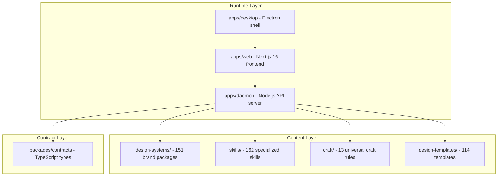

# Project Discovery Report - open-design (UI/UX Focus)

## TL;DR

Open-design is a comprehensive design platform that gives AI agents the ability to generate production-quality UI artifacts by combining **151 portable design systems** (Stripe, Apple, Linear, etc.), **162 specialized skills**, **114 design templates**, and **13 universal craft rules**. Its architecture separates *brand identity* (design systems) from *how to build well* (craft rules) from *what to build* (skills/templates) - a layered approach that produces output with genuine design taste rather than generic AI slop.

## Technical Overview
- **Stack:** TypeScript monorepo (pnpm workspace), Next.js 16 App Router + React 18, Electron desktop shell, Node 24
- **Scale/Maturity:** 151 design systems, 162 skills, 114 templates, 13 craft rules. Active development, production-grade.
- **Key Directories:**
  - [`design-systems/`](file:///home/ubuntu/projects/examples/prompt_base/references/open-design/design-systems) - 151 brand packages (Stripe, Apple, Linear, etc.)
  - [`skills/`](file:///home/ubuntu/projects/examples/prompt_base/references/open-design/skills) - 162 specialized agent skills
  - [`craft/`](file:///home/ubuntu/projects/examples/prompt_base/references/open-design/craft) - 13 universal quality rules
  - [`design-templates/`](file:///home/ubuntu/projects/examples/prompt_base/references/open-design/design-templates) - 114 rendering templates

---

## Best Features (Design-Relevant)

### 1. The Three-Layer Design Architecture (High Confidence)

Open-design separates design concerns into three independent, composable layers:

| Layer | What it owns | Files |
|-------|-------------|-------|
| **Design Systems** (`design-systems/`) | Brand identity: tokens, colors, fonts, components | `DESIGN.md` + `tokens.css` + `manifest.json` |
| **Craft Rules** (`craft/`) | Universal quality standards: typography, color, motion, accessibility, anti-AI-slop | 13 standalone `.md` files |
| **Skills** (`skills/`) | Task-specific workflows: how to build a landing page, a dashboard, a redesign | `SKILL.md` with frontmatter metadata |

A skill can declare which craft rules it needs via `od.craft.requires`, and the system composes them at runtime. Example from [`frontend-design/SKILL.md`](file:///home/ubuntu/projects/examples/prompt_base/references/open-design/skills/frontend-design/SKILL.md#L18-L19):
```yaml
craft:
  requires: [typography, color, anti-ai-slop]
```

### 2. The "Taste Skill" - Anti-Slop Frontend (High Confidence)

The [`taste-skill/SKILL.md`](file:///home/ubuntu/projects/examples/prompt_base/references/open-design/skills/taste-skill/SKILL.md) is 1234 lines / 88KB of deeply opinionated, battle-tested design intelligence. It is the single most valuable file in the repository for UI/UX work. Key innovations:

- **Brief Inference (Section 0):** Forces the agent to "read the room" before touching code - infer page kind, vibe words, audience, brand assets, quiet constraints. Outputs a one-line "Design Read" before generating anything.
- **Three Dials System (Section 1):** `DESIGN_VARIANCE` (1-10), `MOTION_INTENSITY` (1-10), `VISUAL_DENSITY` (1-10) - three numeric dials that control every downstream decision. Each brief maps to dial values via lookup tables.
- **50+ Pre-Flight Checks (Section 14):** A mandatory checklist that catches AI tells before shipping.
- **AI Tell Catalog (Section 9):** 30+ specific "AI slop" patterns identified from production tests - each with a concrete ban and an override path.
- **Reference Vocabulary (Section 10):** Named pattern library (50+ patterns) - hero paradigms, navigation, layouts, cards, scroll animations, galleries, typography, micro-interactions.
- **Canonical Code Skeletons (Section 5):** Working React/GSAP/Motion code for Sticky-Stack, Horizontal-Pan, and Scroll-Reveal patterns.

### 3. Portable Design System Package Format (High Confidence)

Each of the 151 design systems is a self-contained package with a standard contract:

```
design-systems/<slug>/
  manifest.json          # Discovery metadata, provenance
  DESIGN.md              # Canonical design prose for agents
  tokens.css             # Semantic token stylesheet
  USAGE.md               # Agent-facing usage guide
  components.html        # Component fixture
  components.manifest.json  # Component/token index
  design-tokens.json     # Design Tokens JSON
  tailwind-v4.css        # Tailwind v4 mapping
  preview/               # Preview pages
```

### 4. Universal Craft Rules System (High Confidence)

The [`craft/`](file:///home/ubuntu/projects/examples/prompt_base/references/open-design/craft) directory contains 13 research-grounded, auto-lintable quality rules:

| File | What it covers | Key insight |
|------|---------------|-------------|
| [`typography.md`](file:///home/ubuntu/projects/examples/prompt_base/references/open-design/craft/typography.md) | Type scale, leading, letter-spacing, CJK overrides | ALL CAPS without >=0.06em tracking is the #1 AI tell |
| [`color.md`](file:///home/ubuntu/projects/examples/prompt_base/references/open-design/craft/color.md) | Palette structure, accent discipline, contrast minimums | Max 2 visible uses of accent per screen |
| [`animation-discipline.md`](file:///home/ubuntu/projects/examples/prompt_base/references/open-design/craft/animation-discipline.md) | Duration thresholds, curve vs spring, reduced motion | Grounded in Tversky 2002 meta-analysis |
| [`anti-ai-slop.md`](file:///home/ubuntu/projects/examples/prompt_base/references/open-design/craft/anti-ai-slop.md) | 7 cardinal sins + soft/polish tells | Indigo #6366f1 is the most reliable AI tell |
| [`laws-of-ux.md`](file:///home/ubuntu/projects/examples/prompt_base/references/open-design/craft/laws-of-ux.md) | 20+ cognitive/perceptual heuristics | Grounded in primary research sources |
| [`state-coverage.md`](file:///home/ubuntu/projects/examples/prompt_base/references/open-design/craft/state-coverage.md) | 5 required states for every interactive surface | "Populated-only" is the #1 AI design failure |
| [`form-validation.md`](file:///home/ubuntu/projects/examples/prompt_base/references/open-design/craft/form-validation.md) | Form validation timing, error composition | Validate on blur, not first keystroke |
| [`accessibility-baseline.md`](file:///home/ubuntu/projects/examples/prompt_base/references/open-design/craft/accessibility-baseline.md) | WCAG baseline, focus states, ARIA | 12.9KB of detailed guidance |
| [`typography-hierarchy.md`](file:///home/ubuntu/projects/examples/prompt_base/references/open-design/craft/typography-hierarchy.md) | Typography hierarchy patterns | 7.4KB |
| [`typography-hierarchy-editorial.md`](file:///home/ubuntu/projects/examples/prompt_base/references/open-design/craft/typography-hierarchy-editorial.md) | Editorial typography | 8.7KB |
| [`rtl-and-bidi.md`](file:///home/ubuntu/projects/examples/prompt_base/references/open-design/craft/rtl-and-bidi.md) | RTL/BiDi support | 12KB |

### 5. Composable Skill Metadata System (High Confidence)

Skills use YAML frontmatter with an `od:` namespace for rich metadata:

```yaml
od:
  mode: prototype
  surface: web
  category: creative-direction
  craft:
    requires: [typography, color, anti-ai-slop, animation-discipline]
  design_system:
    requires: true
    sections: [color, typography, layout, components]
  example_prompt: "..."
  upstream: "https://..."
```

---

## Applied Takeaways - for `ux-ui-pro-max` skill (ranked by adoption priority)

### 1. Integrate the "Brief Inference" + "Three Dials" System
- **What:** The taste-skill's Section 0 (Brief Inference) + Section 1 (Three Dials) from [`taste-skill/SKILL.md:L40-L106`](file:///home/ubuntu/projects/examples/prompt_base/references/open-design/skills/taste-skill/SKILL.md#L40-L106). Forces reading the brief before touching code, outputs a "Design Read" one-liner, then sets `DESIGN_VARIANCE` / `MOTION_INTENSITY` / `VISUAL_DENSITY` dials.
- **Apply:** Add a new "Brief Inference and Design Configuration" section to `SKILL.md` after the current "When to Apply" section. Include the signal-reading checklist, design-read template, dial inference table, and use-case presets.
- **Impact:** HIGH | **Effort:** LOW | **Risk:** LOW | **Est. time:** 2-3 hours

### 2. Add Anti-AI-Slop Rules (The "Taste Filter")
- **What:** The comprehensive AI-tell catalog from [`taste-skill/SKILL.md:L622-L729`](file:///home/ubuntu/projects/examples/prompt_base/references/open-design/skills/taste-skill/SKILL.md#L622-L729) and [`craft/anti-ai-slop.md`](file:///home/ubuntu/projects/examples/prompt_base/references/open-design/craft/anti-ai-slop.md). 30+ specific banned patterns (AI-purple gradients, three-equal-cards, Inter as default, em-dash overuse, fake screenshots, generic names).
- **Apply:** Add a new "Anti-AI Defaults" section to `SKILL.md` with the 7 cardinal sins, production-test tells, and the em-dash ban. Replace the existing FORBIDDEN AI DEFAULTS reference in `extended-reference.md` with this comprehensive version.
- **Impact:** HIGH | **Effort:** LOW | **Risk:** LOW | **Est. time:** 2-3 hours

### 3. Add Pre-Flight Checklist
- **What:** The 50+ item mandatory pre-flight check from [`taste-skill/SKILL.md:L937-L1006`](file:///home/ubuntu/projects/examples/prompt_base/references/open-design/skills/taste-skill/SKILL.md#L937-L1006). Covers brief inference, dial values, design system, theme lock, color consistency, button contrast, hero fitting, eyebrow count, motion motivation, etc.
- **Apply:** Add a "Pre-Flight Checklist" section at the end of `SKILL.md`. Adapt checklist items to match your skill's existing categories (Accessibility, Touch and Interaction, etc.).
- **Impact:** HIGH | **Effort:** MEDIUM | **Risk:** LOW | **Est. time:** 3-4 hours

### 4. Add Craft Rules as References
- **What:** The 13 craft files from `craft/` - especially [`typography.md`](file:///home/ubuntu/projects/examples/prompt_base/references/open-design/craft/typography.md), [`color.md`](file:///home/ubuntu/projects/examples/prompt_base/references/open-design/craft/color.md), [`animation-discipline.md`](file:///home/ubuntu/projects/examples/prompt_base/references/open-design/craft/animation-discipline.md), [`state-coverage.md`](file:///home/ubuntu/projects/examples/prompt_base/references/open-design/craft/state-coverage.md), and [`laws-of-ux.md`](file:///home/ubuntu/projects/examples/prompt_base/references/open-design/craft/laws-of-ux.md).
- **Apply:** Copy the most critical craft files into `skills/ux-ui-pro-max/references/craft/` and reference them from `SKILL.md`. Key additions: type scale, letter-spacing rules, CJK overrides, three-weight system, palette 4-layer structure, accent discipline (max 2 per screen), animation duration thresholds, 5 required states for every interactive surface.
- **Impact:** HIGH | **Effort:** MEDIUM | **Risk:** LOW | **Est. time:** 4-6 hours

### 5. Add Design System Selection Workflow
- **What:** The "Brief to Design System Map" from [`taste-skill/SKILL.md:L109-L147`](file:///home/ubuntu/projects/examples/prompt_base/references/open-design/skills/taste-skill/SKILL.md#L109-L147). Maps brief types to official design system packages (Material, Fluent, Carbon, Primer, shadcn/ui, etc.) and aesthetic directions (glassmorphism, brutalism, editorial, etc.).
- **Apply:** Add a "Design System Selection" section with the brief-to-system mapping table.
- **Impact:** MEDIUM | **Effort:** LOW | **Risk:** LOW | **Est. time:** 1-2 hours

### 6. Add Pattern Vocabulary and Code Skeletons
- **What:** The Reference Vocabulary (50+ named patterns) from [`taste-skill/SKILL.md:L732-L807`](file:///home/ubuntu/projects/examples/prompt_base/references/open-design/skills/taste-skill/SKILL.md#L732-L807) and canonical code skeletons from [`taste-skill/SKILL.md:L392-L534`](file:///home/ubuntu/projects/examples/prompt_base/references/open-design/skills/taste-skill/SKILL.md#L392-L534).
- **Apply:** Add to `references/` as a new `pattern-vocabulary.md` file.
- **Impact:** MEDIUM | **Effort:** LOW | **Risk:** LOW | **Est. time:** 2-3 hours

### 7. Enhance Typography and Color Sections with Specific Rules
- **What:** Replace current generic guidance ("line-height 1.5-1.75 for body") with concrete, numerical rules from craft/typography.md and craft/color.md. Key additions:
  - Letter-spacing table (body=0, small=+0.01em, ALL CAPS=0.06em-0.1em, display=-0.02em)
  - Three-weight system (Read 400, Emphasize 510, Announce 590)
  - Palette 4-layer structure (Neutrals 70-90%, Accent 5-10%, Semantic 0-5%, Effect <1%)
  - Accent discipline: max 2 visible uses per screen
  - Dark theme: never pure #000 or #fff
- **Impact:** HIGH | **Effort:** MEDIUM | **Risk:** LOW | **Est. time:** 3-4 hours

### 8. Add Redesign Protocol
- **What:** The Redesign Protocol from [`taste-skill/SKILL.md:L810-L859`](file:///home/ubuntu/projects/examples/prompt_base/references/open-design/skills/taste-skill/SKILL.md#L810-L859). Detects greenfield vs preserve vs overhaul, audits before touching, preservation rules, modernization levers (typography first, then spacing, color, motion, hero, blocks).
- **Apply:** Add a "Redesign Workflow" section to `SKILL.md` or as a reference file.
- **Impact:** MEDIUM | **Effort:** LOW | **Risk:** LOW | **Est. time:** 1-2 hours

---

## Architecture

The open-design repository follows a **plugin-oriented monorepo** with clear layered boundaries:



### Inferred ADRs

| Decision | Evidence | Benefits | Trade-offs | Confidence |
|----------|----------|----------|------------|------------|
| Separate craft rules from design systems | `craft/` directory with `od.craft.requires` in skill frontmatter | Skills can compose quality rules independently of brand identity | More files to maintain | High |
| Design systems as self-contained packages | `manifest.json` + `DESIGN.md` + `tokens.css` per package | Portable, machine-readable, versionable independently | Package proliferation (151+) | High |
| Anti-AI-slop as a first-class concern | Entire `anti-ai-slop.md` craft file + P0/P1/P2 severity levels + daemon linter | Measurably different output quality | Opinionated | High |
| Three-dial configuration system | `taste-skill/SKILL.md` Section 1 | Reduces 100+ design decisions to 3 numeric dials | Requires accurate brief inference | High |

---

## Engineering Gems

### 1. [`craft/anti-ai-slop.md`](file:///home/ubuntu/projects/examples/prompt_base/references/open-design/craft/anti-ai-slop.md)
- **Problem:** AI-generated UI looks generically "AI" - same purple gradients, same feature cards, same emoji icons
- **Common approach:** Vague guidelines ("avoid generic designs")
- **Why elegant:** Enumerates 7 specific hex values that trigger automated linting. Separates sins into P0/P1/P2. Ends with "How to add soul" - the 80/20 principle for distinctive design.
- **Reusable lesson:** Concrete, checkable rules beat vague aesthetic guidelines every time

### 2. [`craft/animation-discipline.md`](file:///home/ubuntu/projects/examples/prompt_base/references/open-design/craft/animation-discipline.md)
- **Problem:** When should motion be used, and at what duration/easing?
- **Why elegant:** Grounds every rule in named research (Tversky 2002, Heer and Robertson 2007). Provides exact duration thresholds. Debunks common myths.
- **Reusable lesson:** Citing primary sources prevents design folklore from becoming cargo cult

### 3. Three Dials + Brief Inference ([`taste-skill/SKILL.md:L40-L106`](file:///home/ubuntu/projects/examples/prompt_base/references/open-design/skills/taste-skill/SKILL.md#L40-L106))
- **Problem:** How to configure 100+ design decisions without asking 100 questions
- **Why elegant:** Reduces to 3 numeric dials that cascade through every downstream decision. Values inferred from brief signals via lookup tables.
- **Reusable lesson:** Configuration systems should have few knobs that cascade, not many independent switches

---

## Top 10 Things Worth Learning

| # | Concept | File | Why Useful | Difficulty | Order |
|---|---------|------|-----------|------------|-------|
| 1 | Brief Inference to Design Read | taste-skill:L40-66 | Forces understanding before code | 2/5 | 1st |
| 2 | Three Dials Configuration | taste-skill:L70-106 | Reduces 100+ decisions to 3 knobs | 2/5 | 2nd |
| 3 | Anti-AI-Slop Rules | anti-ai-slop.md + taste-skill:L622-729 | Measurably better output | 2/5 | 3rd |
| 4 | Typography Craft (letter-spacing!) | craft/typography.md | The #1 skipped rule in AI design | 3/5 | 4th |
| 5 | Pre-Flight Checklist | taste-skill:L937-1006 | Catches errors before delivery | 2/5 | 5th |
| 6 | Color Palette Structure (4 layers) | craft/color.md | Prevents accent color overuse | 2/5 | 6th |
| 7 | State Coverage (5 states) | craft/state-coverage.md | "Populated-only" is #1 AI failure | 3/5 | 7th |
| 8 | Animation Duration Thresholds | craft/animation-discipline.md | Research-grounded, not vibes | 3/5 | 8th |
| 9 | Design System Selection Map | taste-skill:L109-147 | Use official packages, don't recreate | 2/5 | 9th |
| 10 | Pattern Vocabulary (50+ patterns) | taste-skill:L732-807 | Shared language for design decisions | 2/5 | 10th |

---

## Reading Guide (by level)

**L0 Build and Run:** Not needed - this is a content repository, no build required for learning.

**L1 Entry Points:** Start with [`AGENTS.md`](file:///home/ubuntu/projects/examples/prompt_base/references/open-design/AGENTS.md) (top 50 lines) then [`design-systems/README.md`](file:///home/ubuntu/projects/examples/prompt_base/references/open-design/design-systems/README.md) then [`skills/taste-skill/SKILL.md`](file:///home/ubuntu/projects/examples/prompt_base/references/open-design/skills/taste-skill/SKILL.md) (first 106 lines - Brief Inference + Three Dials).

**L2 Core Abstractions:** Read the three-layer architecture: `craft/` (all 13 files, start with `anti-ai-slop.md` then `typography.md` then `color.md`), then one complete design system package (e.g., `design-systems/stripe/`), then `skills/frontend-design/SKILL.md`.

**L3 Architecture Glue:** Understand the `od.craft.requires` composition system. Read `skills/impeccable-design-polish/SKILL.md` for the post-generation polish workflow.

**L4 Engineering Gems:** Deep-read `taste-skill/SKILL.md` Sections 4 (Design Engineering Directives), 9 (AI Tells), 14 (Pre-Flight).

**L5 Reimplement:** Build a "brief to design read to dial values to output" pipeline for your ux-ui-pro-max skill.

---

## Anti-Patterns and What NOT to Copy

1. **Taste-skill's 88KB single file:** At 1234 lines, too large for a single skill file. Split into `SKILL.md` (core workflow, <300 lines) + reference files.
2. **React/Next.js/Tailwind defaults:** The taste-skill assumes React + Tailwind v4 + Motion. Your skill should stay stack-agnostic (your current skill supports 9 stacks).
3. **Overly specific font bans:** Banning "Fraunces" and "Instrument_Serif" by name is too narrow for a general-purpose skill. Adapt to principles.
4. **Catalog-only entries:** Many skills are just metadata stubs pointing to upstream repos. Don't mistake stubs for complete implementations.

---

## Questions Worth Asking

1. How does the daemon's `lint-artifact` linter actually enforce the anti-ai-slop rules? Could we build a similar linter?
2. The craft rules cite primary research - should our skill include citations for credibility, or keep it pragmatic?
3. The taste-skill explicitly scopes OUT dashboards, data tables, multi-step forms. Should our enhanced skill maintain broader scope or adopt the same boundaries?
4. Could we adopt the `od.craft.requires` composition pattern for our skill system?

---

## Overall Evaluation

| Architecture | Maintainability | Scalability | Clean Code | Learning Value |
|---|---|---|---|---|
| 9/10 | 7/10 | 8/10 | 9/10 | 10/10 |

The three-layer architecture (design systems / craft rules / skills) is genuinely elegant. Maintainability loses points because of mega-files (taste-skill at 88KB). Learning value is a perfect 10.

---

## Learning Roadmap

| Phase | Duration | Activity |
|-------|----------|----------|
| **Week 1** | 4-6h | Read taste-skill Sections 0-1 (Brief Inference + Dials) + all craft/ files |
| **Week 1** | 3-4h | **Implement Takeaway #1:** Add Brief Inference + Three Dials to ux-ui-pro-max SKILL.md |
| **Week 1** | 2-3h | **Implement Takeaway #2:** Add Anti-AI-Slop rules inline |
| **Week 2** | 3-4h | **Implement Takeaway #3:** Add Pre-Flight Checklist |
| **Week 2** | 4-6h | **Implement Takeaway #4:** Copy critical craft files to references/ |
| **Week 2** | 2-3h | **Implement Takeaway #7:** Enhance Typography and Color sections with specific numbers |
| **Week 3** | 3-5h | **Implement Takeaways #5, #6, #8:** Design System Selection, Pattern Vocabulary, Redesign Protocol |
| **Week 3** | 2-3h | Integration testing - run the enhanced skill on sample briefs and verify output quality |
