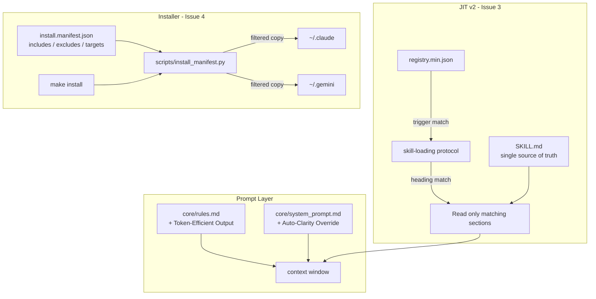

# Design: Caveman Learnings — Prompt & Delivery Refactor

## Architecture

Issues 1–2 are prompt-layer edits (no runtime change). Issues 3–4 change how content is delivered:



## Data Models

```json
// install.manifest.json
{
  "targets": {
    "claude": {"root": "~/.claude", "rules_file": "CLAUDE.md"},
    "gemini": {"root": "~/.gemini", "rules_file": "GEMINI.md"}
  },
  "include": ["core/", "tools/", "antigravity/", "registry.min.json", "ARCHITECTURE.md"],
  "exclude": ["caveman/", ".git*", "docs/", "scripts/", "__pycache__/", "Makefile", "README.md", "*.pyc"]
}
```

Section filtering contract (Issue 3): a skill section is loadable when its `##`/`###` heading, lowercased, shares a keyword with the active task intent; the frontmatter + "Core Principles" section are always loaded as the minimum viable subset.

## Security & Execution Boundaries

| Agent | Allowed Paths | Permissions |
|-------|---------------|-------------|
| Coder | `core/`, `antigravity/skills/core/{context-management,behavioral-modes,skill-loading}/`, `Makefile`, `scripts/`, `install.manifest.json` | Read, Write |
| Coder | `~/.claude`, `~/.gemini` | Write only via `make install`; plus one-time `rm -rf` of stray `caveman/` copies |
| Reviewer (`quality-gatekeeper`) | repo root | Read only |

## Risk Mitigation

| Risk | Severity | Mitigation |
|------|----------|------------|
| New excludes accidentally drop a runtime-essential file from installs | HIGH | Post-install assertion in `install_manifest.py`: verify `registry.min.json`, `core/`, `antigravity/skills/` exist in target; `make install` fails loudly otherwise |
| Auto-Clarity wording too broad → personas never apply | MEDIUM | Scope the override to an explicit trigger list (destructive ops, security warnings, multi-step ambiguity), not "when unsure" |
| Section filtering hides context a skill needs | MEDIUM | Always-load floor (frontmatter + Core Principles); agent may escalate to full-file read when sections reference each other |
| Read-only files in existing target dirs still block first manifest-based install | LOW | `install_manifest.py` uses copy-with-overwrite that `chmod`s or unlinks the destination before writing |
| `cleanup.sh` deletions conflict with new excludes | LOW | Reduce `cleanup.sh` to `__pycache__` pruning only; excludes handle the rest |
