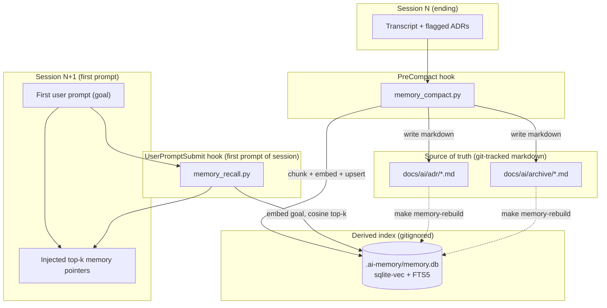

# Design: Automated Context Memory Engine

## Architecture



## Component decisions

### Vector store: `sqlite-vec`
A single-file SQLite extension with vector similarity built in. Chosen over Chroma/LanceDB because:
- One file (`.ai-memory/memory.db`) matches the "per-project, no server" decision — a hook script can't manage a daemon.
- Same file also hosts an **FTS5** virtual table for the keyword-search fallback, so degradation needs no second store.
- No background process, no network — a hook opens it, does its work, closes it.

### Embedding model: local ONNX by default
Default: **`fastembed`** with a small ONNX model (`BAAI/bge-small-en-v1.5`, ~130MB, CPU-only). Rationale: this framework prizes being self-contained and offline (`cleanup.sh` strips dev cruft; skills avoid external calls). A local model keeps recall working with no API key, no egress, no per-call cost.
Opt-in override: if `PB_EMBED_API` (endpoint) and `PB_EMBED_KEY` are set, the engine calls that instead — for teams that prefer a hosted model. **Both paths must produce the same vector dimension**, recorded in a `meta` table so a model swap is detected and forces a rebuild rather than silently corrupting similarity.

### Runtime environment: isolated venv (not global Python)
`fastembed`/`onnxruntime` and `sqlite-vec` are heavy, native, and cross-platform-fragile. Installing them into the user's global Python would be invasive and brittle — and it leaves "which interpreter runs the hook?" unanswered for a globally-installed framework. Instead:
- `make memory-setup` (opt-in, run once) creates a dedicated venv at `~/.claude/venv` (and `~/.gemini/venv`) and `pip install -r requirements.txt` into it.
- The hook entries in `settings.json` invoke **`~/.claude/venv/bin/python tools/memory_*.py`**, not bare `python3`.
- The venv lives outside every path that `make install`'s `rm -rf` touches and outside `cleanup.sh`'s `DEV_ITEMS`, so re-installing the framework does not destroy it. `memory-setup` is idempotent.
- If the venv is absent (feature not set up), the hooks detect it and degrade to no-op / FTS5 keyword mode — the framework runs normally without ever building the venv.

### ADR capture format (strict tag, not heuristic)
`PreCompact` must not *guess* which parts of a transcript are architectural decisions. The agent marks them explicitly with a hard tag that the skill docs instruct it to emit:

```
<adr title="Use sqlite-vec over Chroma">
  <decision>Single-file SQLite vector store.</decision>
  <rationale>No server process; fits per-project + hook model.</rationale>
</adr>
```

`memory_compact.py` extracts these by regex (100% precise), one markdown file per `<adr>` under `docs/ai/adr/YYYY-MM-DD-HHMMSS-<slug>.md`. The timestamp goes down to the second so multiple sessions (or multiple decisions with similar slugs) on the same day cannot silently overwrite each other; if the full name *still* collides (two ADRs in the same second), an 8-char `content_sha` prefix is appended (`…-<sha8>.md`). The writer additionally refuses to overwrite: an existing path with different content is always disambiguated, never clobbered. Absence of any `<adr>` tag is normal — the heuristic session rollup to `docs/ai/archive/` still runs; only precise ADR capture is skipped.

### Source of truth vs. index (resolves the git/binary tension)
- `memory_compact.py` **always writes the human-readable markdown first** (ADR to `docs/ai/adr/`, rollup to `docs/ai/archive/`), then embeds into the DB.
- The DB carries a `source_path` + `content_sha` per row. `make memory-rebuild` truncates the DB and re-embeds every markdown source — so a fresh `git clone` (which has the markdown but not the gitignored DB) restores full recall with one command.
- Net effect: nothing important is ever *only* in the binary. The DB is disposable.

## Data model

```sql
-- meta: guards against silent embedding-model / dimension drift
CREATE TABLE meta (key TEXT PRIMARY KEY, value TEXT);
-- e.g. ('embed_model','bge-small-en-v1.5'), ('embed_dim','384'), ('schema','1')

CREATE TABLE memory (
  id          INTEGER PRIMARY KEY,
  kind        TEXT NOT NULL,      -- 'adr' | 'summary' | 'transcript_chunk'
  title       TEXT,
  body        TEXT NOT NULL,      -- the chunk text (also embedded)
  source_path TEXT,               -- docs/ai/adr/2026-07-13-x.md (NULL for raw chunks)
  content_sha TEXT NOT NULL,      -- dedupe + rebuild idempotency
  created_at  TEXT NOT NULL       -- ISO-8601
);

-- vector index (sqlite-vec)
CREATE VIRTUAL TABLE memory_vec USING vec0(embedding FLOAT[384]);
-- keyword fallback (always populated, used when vec/model unavailable)
CREATE VIRTUAL TABLE memory_fts USING fts5(body, content='memory', content_rowid='id');
```

## Hook contracts

Both hook commands run as `~/.claude/venv/bin/python tools/memory_<x>.py` (venv, see above).

### Host payload contract (normalized)
Hook stdin JSON is **host-specific** — Claude Code and Gemini do not share a schema, and Gemini's is unverified. Each script therefore normalizes stdin into one internal payload before doing anything else; missing/unknown fields are tolerated (they become `null`), never fatal:

```json
{
  "host": "claude | gemini | unknown",
  "event": "PreCompact | SessionStart | UserPromptSubmit",
  "cwd": "abs path the agent was launched from",
  "session_id": "string or null",
  "transcript_path": "abs path or null",
  "prompt": "user message text or null"
}
```

Verified host payloads (fields the adapter reads):

| Host | Event | stdin fields used | Note |
|------|-------|-------------------|------|
| Claude Code | `PreCompact` | `transcript_path`, `cwd`, `session_id`, `trigger` | |
| Claude Code | `SessionStart` | `cwd`, `session_id`, `source` | Carries **no goal/prompt** — semantic recall is impossible here |
| Claude Code | `UserPromptSubmit` | `prompt`, `cwd`, `session_id` | The only event that carries the session goal |
| Gemini | any | **Unverified** | Hooks are NOT registered by `install-gemini` until the adapter is validated against a captured real payload (Task 3.4). Until then Gemini support = manual `make memory-rebuild` + FTS5 CLI only |

Consequence (corrects an earlier assumption in this spec): recall is registered on **`UserPromptSubmit`**, not `SessionStart`, because `SessionStart` has no goal to embed. The recall script self-gates to the *first* prompt of each session via a sentinel (`.ai-memory/last_recall_session` containing the last-served `session_id`) — subsequent prompts in the same session are a no-op costing one file read.

| Hook | Script | Normalized input used | Behavior | Exit |
|------|--------|-----------------------|----------|------|
| `PreCompact` | `tools/memory_compact.py` | `transcript_path`, `cwd` | Resolve project root from `cwd`; read transcript; regex-extract `<adr>` tags → one markdown file each; write a heuristic rollup; embed+upsert (skip rows whose `content_sha` already exists) | **Always 0** |
| `UserPromptSubmit` | `tools/memory_recall.py` | `prompt`, `cwd`, `session_id` | First prompt of session only (sentinel check). Resolve project root; retrieve top-k (default k=5, `PB_RECALL_K`) — vector cosine if within latency budget, else FTS5 over prompt terms; print **title + one-line summary + source path** per hit, capped at `PB_RECALL_MAX_CHARS` (default 2000). Never inject full ADR bodies | **Always 0** |

### Cold-start latency budget (recall must not stall the prompt)
Hooks are transient processes: every invocation pays the full cost of importing `onnxruntime` and loading the ~130MB ONNX model from disk — plausibly multiple seconds cold. That is acceptable where the harness is already pausing, and unacceptable where the user is waiting for their prompt to be processed:

| Hook | User-blocking? | May load the ONNX model? |
|------|----------------|--------------------------|
| `PreCompact` | No (harness is compacting anyway) | Yes |
| `UserPromptSubmit` (recall) | **Yes** | Only if measured load time fits the budget |

Rules:
- `make memory-setup` (and `make memory-bench`, re-runnable) measures cold import+embed wall-clock and records it as `meta.embed_load_ms`.
- Recall uses vector search **only if** `meta.embed_load_ms` exists and is `< PB_RECALL_BUDGET_MS` (default 2000). No recorded measurement, or over budget → FTS5 keyword search over the prompt terms — still relevance-ranked, needs no model, and typically runs in tens of milliseconds. The decision is made *before* paying any model cost, never by aborting a load mid-flight.
- A resident daemon that keeps the model warm is explicitly **out of scope** for this iteration; it is the documented future path if `embed_load_ms` exceeds budget on typical hardware.

### Project-root resolution (never scatter `.ai-memory/`)
Hooks execute with the user's working directory, which may be deep inside the repo (`cd server/pkg/llm && claude`). Naively creating `./.ai-memory` would scatter databases across the tree. All engine paths (`.ai-memory/`, `docs/ai/adr/`, `docs/ai/archive/`) are bound to one resolved root, in priority order:
1. `PB_MEMORY_ROOT` env var, if set (absolute path — explicit override wins).
2. Walk upward from the payload's `cwd`: the first ancestor containing `.git` (directory *or* file, to support worktrees), else one containing `CLAUDE.md` / `GEMINI.md` / `ARCHITECTURE.md`.
3. No marker found up to filesystem root → fall back to `cwd` itself and log a warning to `engine.log`.

Result: exactly one memory DB per repository, regardless of launch directory.

### Recall injection budget (recall must not cause bloat)
The recall block is title/summary/path pointers only, not bodies — so the anti-bloat feature can't become a bloat source. Rules:
- Hard cap: total injected text ≤ `PB_RECALL_MAX_CHARS` (default 2000). If top-k would exceed it, drop lowest-scoring hits until it fits.
- Each hit renders as one line: `• <title> — <≤120-char summary>  (docs/ai/adr/…md)`.
- The agent opens a full ADR file only if the pointer is relevant — consistent with `project-memory`'s "read only what you need" rule.

### Ghost-memory self-healing (index vs. deleted markdown)
If a developer deletes an obsolete ADR from `docs/ai/adr/`, the row survives in `memory.db` until a rebuild — the index drifts and would serve pointers to files that no longer exist. Recall self-heals instead of waiting for `make memory-rebuild`:
- Before rendering, each candidate hit with a non-NULL `source_path` gets a fast existence check (`os.path.exists`, ~µs each for k≤5).
- A missing file → the row (and its `memory_vec` / `memory_fts` entries) is deleted on the spot, and the next-best candidate backfills the slot so the user still gets k results when available.
- Rows with `source_path = NULL` (raw transcript chunks) are exempt — they have no file to check.
- `make memory-rebuild` remains the full reconciliation path (also catches *edited* markdown via `content_sha`); the recall-time check only handles deletions cheaply.

**Non-negotiable:** a hook must never break a session. Any internal error (missing dep, locked DB, corrupt row) is caught, logged to `.ai-memory/engine.log`, and the hook exits 0 with empty output.

## Security & Execution Boundaries

| Actor | Allowed Paths | Permissions |
|-------|---------------|-------------|
| Coder | `tools/memory_*.py`, `requirements.txt`, `settings.json`, `Makefile`, `.gitignore` | Read, Write |
| Coder | `antigravity/skills/core/project-memory/`, `.../context-management/`, `core/memory_rules.md` | Read, Write (doc updates) |
| Hook runtime | `.ai-memory/` (per project), `docs/ai/adr/`, `docs/ai/archive/` | Read, Write |
| Hook runtime | network | **None by default** (local model); only if `PB_EMBED_API` explicitly set |
| Coder | `registry.min.json` | Write via `make registry` only |

## Risk Mitigation

| Risk | Severity | Mitigation |
|------|----------|------------|
| Install pipeline drops the hooks: `cp -r ./*` skips dotfiles, so `settings.json` never reaches `~/.claude` | HIGH | `scripts/install_settings.py` (not a bash/jq one-liner) reads source + installed settings, merges hook entries idempotently (dedupe by matcher+command so re-install adds no duplicates), writes back; verified by asserting exactly one copy of each hook after two `make install` runs |
| Native deps (`onnxruntime`/`sqlite-vec`) pollute or fail against the user's global Python across Mac/Linux/Windows | HIGH | All heavy deps confined to an opt-in `~/.claude/venv` built by `make memory-setup`; hooks call `venv/bin/python`; absent venv → hooks degrade, framework unaffected |
| Recall re-introduces token bloat by injecting long ADRs | MEDIUM | `SessionStart` injects title+summary+path pointers only, hard-capped at `PB_RECALL_MAX_CHARS`; full bodies are read on demand, never auto-injected |
| ADR extraction guesses wrong on free-form transcript text | MEDIUM | Capture is driven by a strict `<adr>` tag the agent is instructed to emit (regex-parsed, 100% precise); no tag → no false ADR, rollup still runs |
| A hook exception aborts or corrupts a real user session | HIGH | Hard contract: hooks wrap everything in try/except, log to `.ai-memory/engine.log`, always exit 0 with empty stdout on failure — covered by a test that feeds malformed stdin |
| Sensitive data (secrets, tokens) from a transcript gets embedded and persisted | HIGH | `memory_compact.py` runs the existing secret patterns before writing; skips chunks matching them; `.ai-memory/` is gitignored so nothing is committed regardless |
| Binary DB committed / bloats repo | MEDIUM | `.gitignore` adds `.ai-memory/`; markdown sources are the tracked artifact |
| Embedding model/dimension changes silently, poisoning similarity | MEDIUM | `meta` table records model+dim; engine refuses to query on mismatch and instructs `make memory-rebuild` |
| Heavy dependency (`fastembed`/`onnxruntime`) fails to install in some environments | MEDIUM | Engine degrades to FTS5 keyword recall when imports fail; feature is enhancement-only, never a hard requirement to run the framework |
| Fresh clone has markdown but no DB (gitignored) → cold recall | LOW | `make memory-init` builds an empty DB; `make memory-rebuild` re-embeds all markdown sources |
| Cold-loading the ~130MB ONNX model stalls the user's first prompt for seconds | HIGH | Recall consults `meta.embed_load_ms` (recorded by `memory-setup`/`memory-bench`) and only uses the model when measured load < `PB_RECALL_BUDGET_MS` (default 2000); otherwise FTS5 over prompt terms; model-loading is unrestricted only in non-blocking `PreCompact` |
| Gemini orchestrator emits a different (or no) hook stdin schema; hooks misparse it | HIGH | All hooks normalize stdin through one host-adapter with a defined internal payload; unknown host/fields → tolerated nulls → no-op exit 0; `install-gemini` does not register hooks until the adapter is validated against a captured real Gemini payload (Task 3.4) |
| Agent launched from a subdirectory scatters `.ai-memory/` DBs across the repo | HIGH | All paths bound to a resolved project root: `PB_MEMORY_ROOT` override → upward walk from payload `cwd` for `.git`/`CLAUDE.md`/`GEMINI.md`/`ARCHITECTURE.md` → logged fallback to `cwd` |
| Same-day ADR slugs silently overwrite each other | MEDIUM | Filenames carry a to-the-second timestamp (`YYYY-MM-DD-HHMMSS-<slug>.md`) plus an 8-char `content_sha` suffix on residual collision; writer never overwrites an existing file with different content |
| Manually deleted ADR markdown leaves "ghost" rows served from the index | MEDIUM | Recall existence-checks each hit's `source_path`, deletes rows whose file is gone, and backfills from next-best candidates; `make memory-rebuild` remains full reconciliation |
