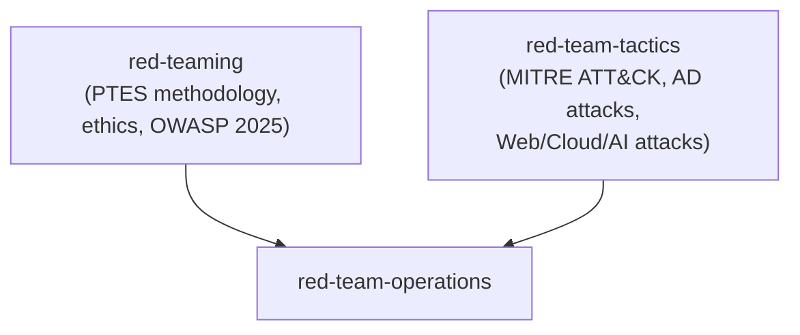

# Design: Red Team Skill Consolidation

## Architecture

## Content Conventions
- Structure `red-team-operations` methodology-first, tactics-second: PTES phases and ethical boundaries set the frame, then the technique catalog (MITRE ATT&CK, AD attacks, Web/Cloud/AI attacks) provides the how-to within that frame. This mirrors how a real engagement is actually run.
- Carry both dated references forward as-is: OWASP Top 10 "(2025)" and the "2026 Landscape" heading for the Web/Cloud/AI section — don't re-strip the dating that skill-modernization-2026 added.

## Security & Execution Boundaries

| Agent | Allowed Paths | Permissions |
|-------|---------------|-------------|
| Coder | `antigravity/skills/process/red-team-operations/` | Read, Write |
| Coder | `antigravity/skills/process/red-team-tactics/`, `antigravity/skills/process/red-teaming/` | Delete (only after content is confirmed migrated) |
| Coder | `antigravity/agents/security-auditor.md` | Read, Write (reference update only) |
| Coder | `registry.min.json` | Write (generated output only, via `make registry`) |

## Risk Mitigation

| Risk | Severity | Mitigation |
|------|----------|------------|
| The recently-added "Web, Cloud & AI Attacks" section (from skill-modernization-2026) gets dropped because the merge is done against a stale mental model of `red-team-tactics`'s content | HIGH | Re-read the current `red-team-tactics/SKILL.md` in full immediately before merging — do not merge from memory or from the pre-modernization version |
| `antigravity/agents/security-auditor.md`'s `skills:` list still references both old names after deletion | HIGH | Task explicitly updates this; verified by grep after the edit — this is the only agent referencing either skill, so a missed update silently breaks its JIT skill loading |
| Merged file reintroduces a duplicate section-number heading (the exact bug already fixed once in `red-team-tactics`) | MEDIUM | Run `grep -n "^## " ` on the merged file and confirm strictly increasing numbers before considering the task done |
