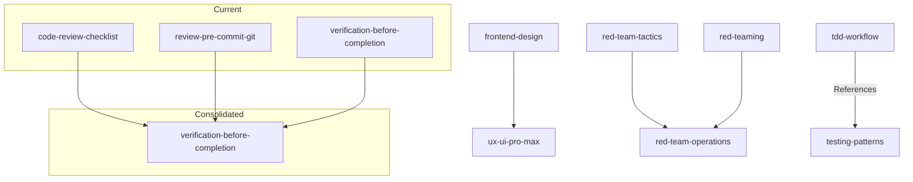

# Design: Skill Consolidation 2026

## Architecture

## Security & Execution Boundaries

| Agent | Allowed Paths | Permissions |
|-------|---------------|-------------|
| Orchestrator | `antigravity/skills/` | Read, Write, Delete |
| Orchestrator | `docs/openspecs/` | Read |
| Orchestrator | `registry.min.json` | Write (via make) |

## Risk Mitigation

| Risk | Severity | Mitigation |
|------|----------|------------|
| Dangling References | HIGH | Ensure `grep` is run across `antigravity/agents/` and `antigravity/global_workflows/` to update any hardcoded references to deprecated skills. |
| Missing Information | MEDIUM | Before deleting a skill, manually verify its unique contents are migrated to the destination skill. |
