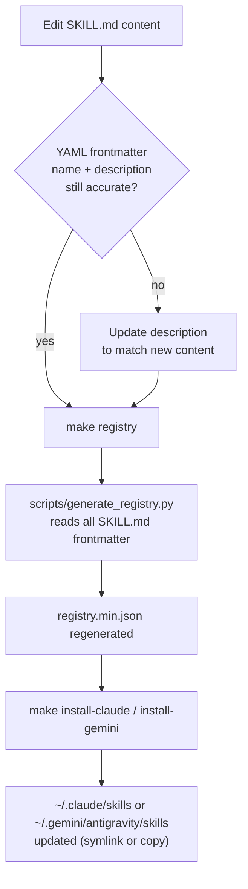

# Design: Skill Modernization 2026

## Overview
This is a content-authoring effort, not a code-architecture change — there is no new service, schema, or API. This document records the conventions every edited `SKILL.md` must follow and how a content edit becomes discoverable, so edits stay consistent across the 15 files touched across different tasks/sessions.

## Pipeline

`registry.min.json` is generated, never hand-edited (confirmed via `scripts/generate_registry.py`, which parses YAML frontmatter out of every `SKILL.md`). A body-content edit with no frontmatter change still requires `make registry` to be re-run so the registry's checksums/timestamps (if any) stay in sync — treat it as mandatory after every task in `tasks.md`, not optional.

## Content Conventions (apply to every file touched by this spec set)

- **Additive by default.** Per `proposal.md`, no skill is being deleted or restructured — new content is appended into the existing section structure of each file (e.g. `mcp-builder`'s transport section gains a Streamable HTTP subsection; it does not get reorganized).
- **Match existing depth.** Skills that defer detail to `references/*.md` sub-files (`typescript-expert`, `mobile-design`, `database-design`) should get new content in the same layered style — a pointer + summary in `SKILL.md`, detail in a reference file — rather than inlining long new sections into the main file and breaking the JIT-loading budget (`skill-loading` caps context at "3-4 skills at once").
- **Date claims that can go stale again.** Where the report flagged missing/ambiguous dating (`red-teaming`'s OWASP reference, `behavioral-modes`' hardcoded "(2025)"), the fix must either name a specific version/year explicitly (matching `vulnerability-scanner`'s "OWASP Top 10:2025" pattern) or avoid dating claims that don't need it — not swap one implicit staleness risk for another.
- **Trade-offs, not mandates, for opinionated picks.** `coding-standards`' REQ-M05 fix should read as "X trades off Y for Z; prefer X when...", consistent with how `database-design`'s `orm-selection.md` already frames Drizzle vs. Prisma.

## Security & Execution Boundaries

| Agent | Allowed Paths | Permissions |
|-------|---------------|-------------|
| Coder (implementing this spec) | `antigravity/skills/**/SKILL.md`, `antigravity/skills/**/references/*.md` | Read, Write |
| Coder (implementing this spec) | `registry.min.json` | Write (generated output only, via `make registry` — no manual edits) |
| Coder (implementing this spec) | `docs/reports/skill-evaluation-2026.md` | Read only (source of truth for scope; update status notes there only if explicitly asked) |
| Reviewer | `antigravity/skills/`, `registry.min.json` | Read only |

No task in this spec set touches `core/`, `Makefile`, `scripts/`, or agent definitions — those are out of scope.

## Risk Mitigation

| Risk | Severity | Mitigation |
|------|----------|------------|
| New content pushes a `SKILL.md` past a size where JIT loading becomes expensive | MEDIUM | Prefer reference-file delegation over inlining (see Content Conventions); no file should roughly double in line count from one task |
| `registry.min.json` regenerated from a broken/incomplete edit mid-task | LOW | Run `make registry` only after a given skill's task is fully complete, not mid-edit |
| YAML frontmatter `description` left stale after body changes, causing wrong auto-trigger routing | MEDIUM | REQ-M07 explicitly checks `seo-fundamentals`/`geo-fundamentals` description disambiguation; apply the same description-accuracy check to every other touched skill even where not called out by a REQ |
| `seo-fundamentals`/`geo-fundamentals` merge (if chosen over cross-reference) breaks existing auto-trigger keyword matches for either skill | MEDIUM | Decide merge vs. cross-reference explicitly in Task 3.x (see `tasks.md`) before editing either file, and re-check both skills' trigger keywords against `registry.min.json` after the change |
| Version pins in `coding-standards` (REQ-M05) go stale again shortly after this fix | LOW | Frame as trade-offs rather than fixed version mandates, per Content Conventions — trade-off framing ages slower than "current major version" framing |
