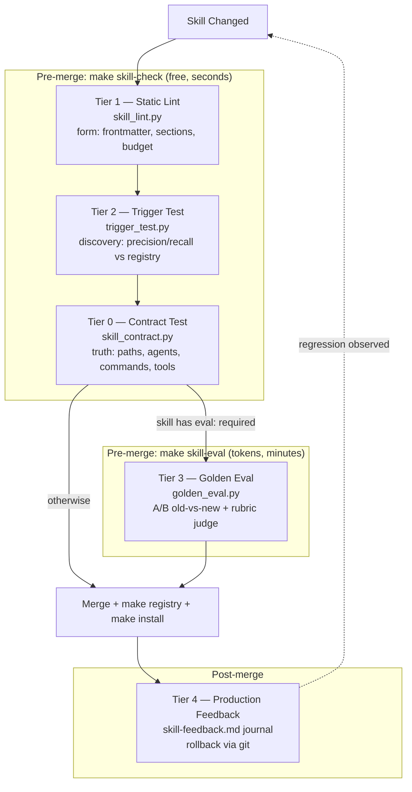

# Design: Skill Quality Gates — 5-Tier Verification Pipeline

## Architecture



Cost gradient is the organizing principle: Tiers 1→2→0 are deterministic and token-free so they gate **every** change; Tier 3 costs tokens so it gates only enrolled skills; Tier 4 costs calendar time so it is a journal, not a gate.

## Data Models

```json
// tests/skills/trigger_cases.json
{
  "cases": [
    {"prompt": "explore this repo and tell me what I can learn", "expect": ["explore-codebase"]},
    {"prompt": "write a Dockerfile for this service", "expect": ["docker-expert"]},
    {"prompt": "fix this typo in README", "expect": []}
  ],
  "thresholds": {"precision": 0.9, "recall": 0.9}
}
```

```yaml
# evals/golden/<skill>/task1.yaml — actual schema as implemented
prompt: "Use the explore-codebase skill on ./fixtures/mini-express-app and produce the report."
judge_model: "gemini-2.5-flash"   # accepted in schema; not yet wired into golden_eval.py (see risk table)
rubric:
  - name: "Evidence"
    weight: 2
    description: "Are hidden gems backed by specific file paths and line numbers?"
  - name: "Format"
    weight: 1
    description: "Does the output follow the report template?"
```

```markdown
<!-- docs/reports/skill-feedback.md (journal entry format) -->
| Date | Skill | Incident | Severity | Action |
|------|-------|----------|----------|--------|
| 2026-07-14 | explore-codebase | cited nonexistent file in report | HIGH | add contract fixture |
```

Contract extraction rules (Tier 0), applied to the skill body:
| Claim pattern in SKILL.md | Verification |
|---------------------------|--------------|
| Backtick path (`core/rules.md`, `scripts/*.py`) | path exists in repo |
| Reference to an agent (`quality-gatekeeper`) | agent defined in `antigravity/agents/` |
| Reference to another skill (`code-graph-analysis`) | entry exists in `registry.min.json` |
| Named CLI (`git`, `madge`, `pydeps`) | `command -v` succeeds **or** skill marks it optional |
| Body instructs tool use ("run `git log`", "Write the report") | corresponding tool present in `allowed-tools` |

## Golden Eval Flow (Tier 3) — as implemented

1. `git show HEAD:<skill-path>` reads the old `SKILL.md` content into memory. The working-tree `SKILL.md` is **never written to** — old and new content both live only as in-memory strings passed as `system_instruction` per API call.
2. A temp workspace is populated from `evals/golden/fixtures/` (currently `mini-app/`, a small Node.js fixture with one deliberate "hidden gem" and one deliberate anti-pattern) — this is what the model under test actually explores.
3. For each golden task: `run_agent` executes a real Gemini function-calling loop (`read_file` / `list_files` / `grep`, sandboxed to the temp workspace, path-traversal rejected, up to `MAX_TOOL_TURNS`), once for the old skill body, once for the new — so file-reading skills like `explore-codebase` are actually grounded rather than asked to freehand a report.
4. Both outputs plus the task's rubric are sent to the judge (`evals/golden/judge_template.txt`) using the task's own `judge_model` field (now actually wired through), which returns `{score, status, reasoning}`; `status` ∈ `BETTER | SAME | WORSE`.
5. Emit `docs/reports/EVAL-<skill>-<date>.md`: per-task status and score, plus judge reasoning.
6. Exit non-zero if any task's status is `WORSE`. API calls retry on HTTP 429 with backoff (up to 5 attempts).

**History:** a 2026-07-14 review found the original implementation ungrounded (no tool access, empty `fixtures/`, in-place mutation of the live `SKILL.md` with no restore-on-crash guarantee, unused `judge_model` field) — the one real run produced empty output on both sides for all 3 tasks. All four were fixed same-day (see Task 3.1b in `tasks.md`). Live end-to-end confirmation is still pending: the default model (`gemini-1.5-pro`) had been deprecated (404), and the replacement (`gemini-2.5-flash`) hit the API key's free-tier quota (20 req/day) while iterating on the fix. The tool-calling mechanics were verified correct via a mocked API response instead — `execute_tool` was confirmed to return real fixture file content and the loop was confirmed to correctly resolve a call → tool-result → final-answer turn.

## Security & Execution Boundaries

| Agent | Allowed Paths | Permissions |
|-------|---------------|-------------|
| Coder | `scripts/`, `tests/skills/`, `evals/golden/`, `Makefile`, `docs/` | Read, Write |
| Coder | `antigravity/skills/` | Read only (pipeline verifies skills, never edits them) |
| Golden Eval runner | scratchpad temp dirs, `evals/golden/fixtures/` | Read, Write (sandboxed; fixtures only, never the live repo) |
| Judge model | task output text only | No tool access |

## Risk Mitigation

| Risk | Severity | Mitigation |
|------|----------|------------|
| LLM-judge noise flips BETTER/WORSE verdicts | HIGH | Weighted rubric with binary per-criterion checks; judge runs at temperature 0; `SAME` band (±1 point) never blocks |
| Golden eval cost creep | MEDIUM | Opt-in via `eval: required`; cap 5 tasks/skill; cheap judge model (Haiku) |
| Trigger cases go stale as skills are added | MEDIUM | `trigger_test.py` warns when a registered skill has zero cases; `create_skill.py` prompts for one seed case |
| Contract test false positives (e.g., illustrative paths in examples) | MEDIUM | Skip fenced code blocks marked `example`; support `<!-- contract:ignore -->` escape comment |
| Tier 0 naming confusion with TIER 0 rules in CLAUDE.md | LOW | Docs always say "Contract Test (pipeline Tier 0)"; Makefile target named `skill-check`, not `tier0` |
