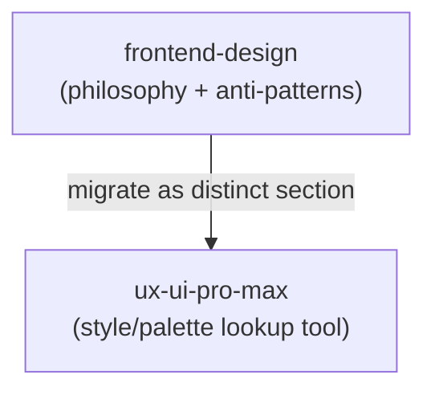

# Design: UI/UX Skill Consolidation

## Architecture

## Content Conventions
- Do not interleave `frontend-design`'s principles content line-by-line into `ux-ui-pro-max`'s existing style-database sections. Add it as its own clearly-labeled section (e.g. "## Design Principles & Anti-Patterns") so a reader looking for "why" (psychology, anti-patterns) isn't stuck skimming a "what" (style/palette catalog) structure to find it.
- The "Forbidden AI Defaults" list is the highest-value content being migrated — it's the only part of either skill that actively prevents a specific class of generic-looking output. Treat it as non-negotiable to preserve, not optional "if there's room."

## Security & Execution Boundaries

| Agent | Allowed Paths | Permissions |
|-------|---------------|-------------|
| Coder | `antigravity/skills/tech/ux-ui-pro-max/` | Read, Write |
| Coder | `antigravity/skills/process/frontend-design/` | Delete (only after content is confirmed migrated) |
| Coder | `antigravity/agents/frontend-specialist.md` | Read, Write (reference update only) |
| Coder | `registry.min.json` | Write (generated output only, via `make registry`) |

## Risk Mitigation

| Risk | Severity | Mitigation |
|------|----------|------------|
| "Forbidden AI Defaults" anti-pattern list silently dropped during migration | HIGH | Task 1.1 requires a line-by-line diff check against the source file before deletion, not just a general "looks migrated" pass |
| `antigravity/agents/frontend-specialist.md`'s `skills:` list still references `frontend-design` after deletion | MEDIUM | Task 1.2 explicitly updates this; verified by grep after the edit |
| `ux-ui-pro-max`'s YAML `description` doesn't pick up `frontend-design`'s former trigger keywords (e.g. "layout philosophy," "design principles"), so those requests stop matching any skill | LOW | Review and extend `ux-ui-pro-max`'s description alongside the content merge, not as an afterthought |
