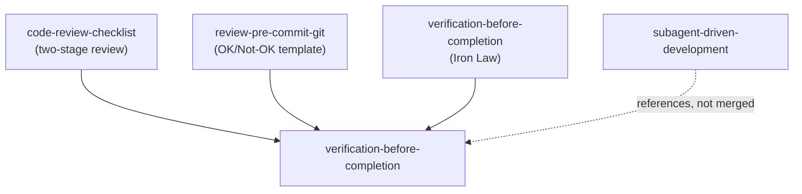

# Design: Verification Skill Consolidation

## Architecture

## Content Conventions
- `verification-before-completion` already has an "Iron Law" framing (no completion claims without fresh, executed evidence). The incoming content from `code-review-checklist` (two-stage review) and `review-pre-commit-git` (OK/Not-OK template) should be added as distinct sections or reference files under this skill, not blended into the Iron Law language — they're related but distinct sub-processes (self-verification vs. reviewing someone else's/an agent's diff vs. formatting pre-commit output).
- Keep the pre-commit OK/Not-OK template's exact output format intact, since `antigravity/global_workflows/review.md` depends on that format shape downstream.

## Security & Execution Boundaries

| Agent | Allowed Paths | Permissions |
|-------|---------------|-------------|
| Coder | `antigravity/skills/process/verification-before-completion/`, `antigravity/skills/process/subagent-driven-development/SKILL.md` | Read, Write |
| Coder | `antigravity/skills/process/code-review-checklist/`, `antigravity/skills/process/review-pre-commit-git/` | Delete (only after content is confirmed migrated) |
| Coder | `antigravity/agents/test-engineer.md`, `antigravity/global_workflows/review.md` | Read, Write (reference updates only) |
| Coder | `registry.min.json` | Write (generated output only, via `make registry`) |

## Risk Mitigation

| Risk | Severity | Mitigation |
|------|----------|------------|
| `antigravity/global_workflows/review.md` invokes `tool="review-pre-commit-git"` as a literal string (line 53), not just a prose mention — a rename without updating this breaks the `/review` workflow outright | HIGH | Task 1.2 requires updating all 3 occurrences in `review.md` (description, activation instruction, and the `tool=` invocation) to `verification-before-completion`, verified by grep after the edit |
| `antigravity/agents/test-engineer.md`'s `skills:` frontmatter lists `code-review-checklist` by name | MEDIUM | Task 1.3 explicitly updates this list; verified by grep for the old name across `antigravity/agents/` after the edit, not just the workflow directory |
| Content lost in the merge (e.g. `code-review-checklist`'s anti-pattern examples) | MEDIUM | Before deleting either source directory, diff its content against what landed in `verification-before-completion` |
| `subagent-driven-development` left with a stale inline description of "two-stage review" after `verification-before-completion` evolves | LOW | REQ-M02 turns this into a reference rather than a duplicate description, so future changes to the review process only need to happen in one place |
