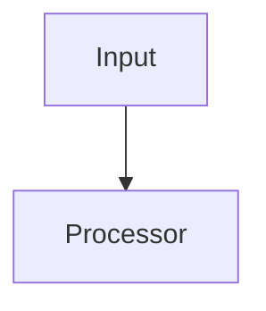

### 3.4 `design.md` — Technical Design (Large Tasks Only)

The design document focuses on the reasoning (Why this design?) over just diagrams. It helps developers 6 months from now understand why specific architectural choices were made.

<details>
<summary>Template: design.md</summary>

````markdown
# Design: <Task Name>

## Key Decisions
- **Decision:** [e.g. Use async processing.]
- **Reason:** [e.g. Avoid blocking user request on external provider latency.]

## Approach
[Why did we choose this specific design/architecture over others?]

## Alternatives Considered
[What other approaches were evaluated? Why were they rejected?]

## Architecture


## Interfaces & Contracts
[Define APIs, DB models, events, or schemas that affect correctness]

## Security Boundaries
[System boundaries, authentication logic, runtime permissions]

## Performance Considerations
[Expected load, latency budgets, throughput targets, caching strategy. Write "N/A" for non-performance-sensitive changes.]
- **Expected throughput:** [e.g. ~500 req/s at peak]
- **Latency budget:** [e.g. p99 < 200ms]
- **Caching:** [e.g. Redis cache with 5min TTL for user profile]
- **Known bottlenecks:** [e.g. External payment API ~300ms avg]

## Observability

### Metrics
[Key business and technical metrics to track.]
- [e.g. `payment.retry.count` — counter per retry attempt]
- [e.g. `payment.retry.success_rate` — gauge]

### Logging
[What to log and at what level. Avoid logging PII.]
- [e.g. INFO: retry attempt with order_id, attempt_number]
- [e.g. ERROR: final failure with order_id, error_code]

### Tracing
[Distributed tracing spans to add. Write "N/A" if single-service.]
- [e.g. Span: `payment.process` → child span: `payment.retry`]

## Risks
[What could go wrong? e.g. Memory leak under high load. Mitigation strategy?]
````

</details>

### 3.5 `tasks.md` — Implementation Map (Medium/Large Tasks)

> 📌 **This is an implementation map, not a Jira checklist.**
> Do not use generic `Task 1, Step 1`. Organize by Phases and focus on the "Why", "Files", "Changes", and "Verify" for each logical chunk of work.
> Each `Changes`/`Verify` line uses `- [ ]` checkbox syntax — progress is tracked by checking these off, not by a separate status field.

<details>
<summary>Template: tasks.md</summary>

````markdown
# Implementation Map: <Task Name>

**Goal:** [One sentence describing what this builds]
**Tech Stack:** [Key technologies/libraries]

---

## Phase 1: [e.g. Database changes]

### [Logical Chunk of Work, e.g. Add retry policy]

**Why:**
[Context for the agent/dev: Required to handle temporary failures without manual intervention.]

**Depends on:** 
- [List any previous implementation chunks this relies on]

**Files:**
- [Exact file paths, e.g. `payment/retry.go`]

**Changes:**
- [ ] Add retry classifier
- [ ] Add exponential backoff strategy

**Verify:**
- [ ] Timeout retries successfully up to 3 times
- [ ] Invalid card does not retry at all

## Phase 2: [e.g. API changes]
...

---

## Rollback Plan

> *Include this section for any task rated Medium+ that touches production data, public APIs, or infrastructure. Skip for isolated code-only changes with no deployment risk.*

### Feature Flags
- [ ] [e.g. `ENABLE_RETRY_V2` flag — set to `false` to revert to old behavior]

### Database Rollback
- [ ] [e.g. Reverse migration: `migrate down 20240101_add_retry_table`]
- [ ] [e.g. Data backfill is idempotent — no rollback needed]

### Safe Deploy
- [ ] [e.g. Canary deploy to 5% traffic before full rollout]
- [ ] [e.g. Monitor `payment.retry.error_rate` for 30min post-deploy]
- [ ] [e.g. Instant rollback via feature flag, no redeploy needed]
````

</details>

---

## 4. Golden Rules

| # | Rule | Description |
|---|------|-------------|
| 1 | **Single Source of Truth** | The spec aligns intent with implementation. |
| 2 | **Progressive Complexity** | Use the smallest spec that removes ambiguity. |
| 3 | **Explicit Boundaries** | Define what is included and excluded. |
| 4 | **Validation Proportional to Risk** | Add tests, schemas, and contracts when they protect correctness. |
| 5 | **Avoid Speculative Design** | Build only what's asked. |
| 6 | **Minimize Ambiguity** | Spec exists to remove uncertainty, not document everything. |
| 7 | **Preserve Intent** | Document decisions that, if lost, would cause others to choose the wrong direction. |
| 8 | **Prefer Decisions Over Descriptions** | Capture the choice made and why, not just what the system does. |

---

## 5. Authoring Decision Matrix

| Situation | Complexity | Output Namespace |
|-----------|------------|------------------|
| UI tweak, simple bug fix | **Small** | `docs/openspecs/<task-name>/spec.md` (1 file) |
| Independent feature, minor refactoring | **Medium** | `docs/openspecs/<task-name>/` (3 files: proposal, specs, tasks) |
| New architecture, large migration | **Large** | `docs/openspecs/<task-name>/` (4 files: proposal, design, specs, tasks) |

---

## 6. Anti-Patterns

| ❌ Don't | ✅ Do |
|----------|-------|
| Write a 4-file spec for a 5-line CSS change | Use the **Small Task** template (`spec.md` only) |
| Create generic checklist steps (Task 1, Step 2) | Use the **Implementation Map** style organized by Phases (`tasks.md`) |
| Assume implementation details before understanding the problem | Capture decisions and constraints first |
| Copy expected behaviors into tasks | Specs describe WHAT must be true. Tasks describe HOW files change. |
| Skip the Impact table in `proposal.md` | Always list affected files — agents depend on this for context loading |
| Document decisions only in code comments | Capture important decisions in the spec |

---

## 7. Checklist Before Submission

- [ ] Spec complexity correctly matches task complexity (Small/Medium/Large).
- [ ] Decisions, Trade-offs, and "Out of Scope" are clearly documented.
- [ ] No speculative design or unnecessary abstractions.
- [ ] Verification methods (Verify) are defined for every implementation block.

---

## 8. Code Staleness Cleanup

> **Principle:** Every feature change is an opportunity to remove the code it replaces. Dead code is not "harmless" — it misleads future readers and AI agents into thinking removed behavior still exists.

### When to trigger

Run a staleness check **during implementation** whenever the task:
- Replaces or supersedes an existing behavior (new handler, new algorithm, new schema)
- Deprecates a feature flag, config key, or API endpoint
- Migrates from one library/pattern to another (e.g., callback → async/await, REST → gRPC)

### Cleanup procedure

| Step | Action | Detail |
|------|--------|--------|
| 1 | **Identify replaced code** | Before writing new code, grep for the old function/class/route/config that the new implementation replaces. |
| 2 | **Trace dependents** | Follow imports, call-sites, and tests that reference the old code. Use `grep -rn`, IDE references, or `ARCHITECTURE.md` → File Dependencies. |
| 3 | **Remove or migrate** | Delete dead code paths. If partial migration (old + new coexist temporarily), add a `// TODO(cleanup): remove after <condition>` with a concrete condition (date, feature flag removal, migration completion). |
| 4 | **Clean orphans** | Remove orphaned imports, unused variables, empty files, and stale feature flags that the deletion created. |
| 5 | **Verify no regression** | Run the project's test suite. Confirm no remaining reference to the deleted symbol exists (`grep` the codebase). |

### tasks.md integration

When writing `tasks.md`, add a **Cleanup** sub-section to any Phase that replaces existing behavior:

```markdown
### [Feature: New retry handler]

**Changes:**
- [ ] Implement new retry handler in `payment/retry_v2.go`
- [ ] Wire new handler into the service layer

**Cleanup:**
- [ ] Remove old `payment/retry.go` and all call-sites
- [ ] Delete unused `RetryConfig` struct from `config/payment.go`
- [ ] Remove stale test `payment/retry_test.go` assertions for old behavior

**Verify:**
- [ ] `grep -rn "retry.go" .` returns zero hits (excluding git history)
- [ ] All tests pass
```

---

## 9. Documentation Sync

> **Principle:** If code changed but docs didn't, the docs are now lying. Stale documentation is worse than no documentation — it actively misleads.

### When to trigger

Run a doc-sync check **after implementation** whenever the task:
- Changes a public API (request/response shape, endpoints, error codes)
- Modifies database schema or data models
- Alters configuration keys, environment variables, or feature flags
- Changes user-facing behavior (UI flows, CLI commands, permissions)
- Removes or renames any exported symbol

### Documentation targets

Scan the following locations for staleness (skip any that don't exist in the project):

| Target | Typical paths | What to check |
|--------|--------------|---------------|
| **README** | `README.md`, `docs/README.md` | Setup steps, feature list, architecture overview, example commands |
| **API docs** | `docs/api/`, Swagger/OpenAPI specs, Postman collections | Endpoints, request/response schemas, auth requirements |
| **Architecture docs** | `ARCHITECTURE.md`, `docs/architecture/` | Component descriptions, dependency graphs, data flow |
| **OpenSpec docs** | `docs/openspecs/` | Previous specs that describe behavior now changed — mark as `[SUPERSEDED]` or update |
| **Inline doc-comments** | Source files (JSDoc, GoDoc, docstrings) | Function signatures, parameter descriptions, usage examples |
| **Config/env docs** | `.env.example`, `docs/config.md` | Removed/renamed keys, new required variables |
| **Changelog** | `CHANGELOG.md` | Add entry for breaking changes, deprecations, new features |

### Sync procedure

| Step | Action |
|------|--------|
| 1 | **List changed symbols** — Collect every function, endpoint, config key, schema field, or CLI flag that was added, modified, or removed during implementation. |
| 2 | **Grep docs for references** — `grep -rn "<symbol>" docs/ README.md ARCHITECTURE.md` to find all doc mentions. |
| 3 | **Update or remove** — For each stale reference: update the description to match new behavior, or remove the section if the feature no longer exists. |
| 4 | **Mark superseded specs** — If an OpenSpec under `docs/openspecs/` describes behavior that was replaced, add a header: `> ⚠️ **SUPERSEDED** by [new-spec](../new-task/spec.md) on YYYY-MM-DD.` |
| 5 | **Verify doc accuracy** — Re-read each updated doc section and confirm it matches the current code. |

### tasks.md integration

Add a **Doc Sync** phase at the end of `tasks.md` for any task that touches public interfaces:

```markdown
## Phase N: Documentation Sync

### Update project docs

**Why:**
Code changes in previous phases altered public API / config / behavior. Docs must reflect reality.

**Files:**
- `README.md`
- `docs/api/endpoints.md`
- `ARCHITECTURE.md`
- `docs/openspecs/old-feature/spec.md`

**Changes:**
- [ ] Update API endpoint docs for new `/v2/retry` route
- [ ] Remove references to deprecated `RETRY_MAX_COUNT` env var from `.env.example`
- [ ] Mark `docs/openspecs/old-retry/spec.md` as SUPERSEDED
- [ ] Update architecture diagram to show new retry flow

**Verify:**
- [ ] `grep -rn "RETRY_MAX_COUNT" docs/` returns zero hits
- [ ] README setup instructions work on a clean checkout
```
