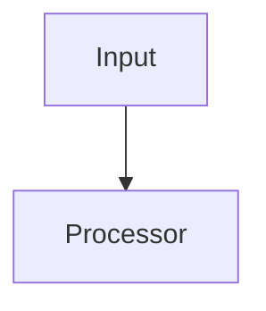

### 3.4 `design.md` — Technical Design (Large Tasks Only)

The design document focuses on the reasoning (Why this design?) over just diagrams. It helps developers 6 months from now understand why specific architectural choices were made.

<details>
<summary>Template: design.md</summary>

````markdown
# Design: <Task Name>

## Key Decisions
- **Decision:** [e.g. Use async processing.]
- **Reason:** [e.g. Avoid blocking user request on external provider latency.]

## Approach
[Why did we choose this specific design/architecture over others?]

## Alternatives Considered
[What other approaches were evaluated? Why were they rejected?]

## Architecture


## Interfaces & Contracts
[Define APIs, DB models, events, or schemas that affect correctness]

## Security Boundaries
[System boundaries, authentication logic, runtime permissions]

## Risks
[What could go wrong? e.g. Memory leak under high load. Mitigation strategy?]
````

</details>

### 3.5 `tasks.md` — Implementation Map (Medium/Large Tasks)

> 📌 **This is an implementation map, not a Jira checklist.**
> Do not use generic `Task 1, Step 1`. Organize by Phases and focus on the "Why", "Files", "Changes", and "Verify" for each logical chunk of work.
> Each `Changes`/`Verify` line uses `- [ ]` checkbox syntax — progress is tracked by checking these off, not by a separate status field.

<details>
<summary>Template: tasks.md</summary>

````markdown
# Implementation Map: <Task Name>

**Goal:** [One sentence describing what this builds]
**Tech Stack:** [Key technologies/libraries]

---

## Phase 1: [e.g. Database changes]

### [Logical Chunk of Work, e.g. Add retry policy]

**Why:**
[Context for the agent/dev: Required to handle temporary failures without manual intervention.]

**Depends on:** 
- [List any previous implementation chunks this relies on]

**Files:**
- [Exact file paths, e.g. `payment/retry.go`]

**Changes:**
- [ ] Add retry classifier
- [ ] Add exponential backoff strategy

**Verify:**
- [ ] Timeout retries successfully up to 3 times
- [ ] Invalid card does not retry at all

## Phase 2: [e.g. API changes]
...
````

</details>

---

## 4. Golden Rules

| # | Rule | Description |
|---|------|-------------|
| 1 | **Single Source of Truth** | The spec aligns intent with implementation. |
| 2 | **Progressive Complexity** | Use the smallest spec that removes ambiguity. |
| 3 | **Explicit Boundaries** | Define what is included and excluded. |
| 4 | **Validation Proportional to Risk** | Add tests, schemas, and contracts when they protect correctness. |
| 5 | **Avoid Speculative Design** | Build only what's asked. |
| 6 | **Minimize Ambiguity** | Spec exists to remove uncertainty, not document everything. |
| 7 | **Preserve Intent** | Document decisions that, if lost, would cause others to choose the wrong direction. |
| 8 | **Prefer Decisions Over Descriptions** | Capture the choice made and why, not just what the system does. |

---

## 5. Authoring Decision Matrix

| Situation | Complexity | Output Namespace |
|-----------|------------|------------------|
| UI tweak, simple bug fix | **Small** | `docs/openspecs/<task-name>/spec.md` (1 file) |
| Independent feature, minor refactoring | **Medium** | `docs/openspecs/<task-name>/` (3 files: proposal, specs, tasks) |
| New architecture, large migration | **Large** | `docs/openspecs/<task-name>/` (4 files: proposal, design, specs, tasks) |

---

## 6. Anti-Patterns

| ❌ Don't | ✅ Do |
|----------|-------|
| Write a 4-file spec for a 5-line CSS change | Use the **Small Task** template (`spec.md` only) |
| Create generic checklist steps (Task 1, Step 2) | Use the **Implementation Map** style organized by Phases (`tasks.md`) |
| Assume implementation details before understanding the problem | Capture decisions and constraints first |
| Copy expected behaviors into tasks | Specs describe WHAT must be true. Tasks describe HOW files change. |
| Skip the Impact table in `proposal.md` | Always list affected files — agents depend on this for context loading |
| Document decisions only in code comments | Capture important decisions in the spec |

---

## 7. Checklist Before Submission

- [ ] Spec complexity correctly matches task complexity (Small/Medium/Large).
- [ ] Decisions, Trade-offs, and "Out of Scope" are clearly documented.
- [ ] No speculative design or unnecessary abstractions.
- [ ] Verification methods (Verify) are defined for every implementation block.
